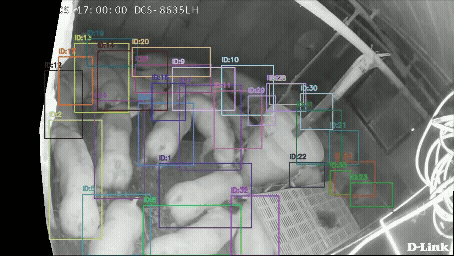

# OinkTrack
OinkTrack is a large-scale multi-pig tracking dataset collected from real-world commercial farms.

It features over 5 hours of annotated videos across various lighting conditions (day, night, transitions), with dense groups of pigs under occlusions and appearance similarity challenges. The dataset includes 573,700 bounding boxes for 574 consistent identities, supporting research on long-term tracking and behavior analysis in precision livestock farming.

<div align="center"></div>


## Dataset
Download the dataset from [Google Drive](https://drive.google.com/drive/folders/1G9ygFt_G6f4SUguMmxCgKxRFgmVpmYSE?usp=drive_link).


Organize as follows:
~~~
{OinkTrack ROOT}
|-- OinkTrack
|   |-- C1D-1
|   |   |-- raw_videos
|   |   |   |-- 20241206_075959_080059
|   |   |       |-- 1733443200-1733443214.ts
|   |   |       |-- 1733443215-1733443229.ts
|   |   |       |-- ...
|   |   |-- annotation.json
|   |-- C1D-2
|   |-- C1D-3
|   |-- ...
|   |-- mask
        |-- C1_mask.png
        |-- C2_mask.png
~~~

Each folder under `OinkTrack` corresponds to a specific scene and lighting condition:

* `C1D-*`, `C1N-*`, `C1DN-*`, etc.:

  * `C1` and `C2` refer to different camera views .
  * `D` = Daytime, `N` = Nighttime, `DN` = Day-to-Night transition, `ND` = Night-to-Day transition.

## Build a MOT-style dataset

This repository ships a helper script, **`make_dataset.py`**, that converts the raw OinkTrack recordings ( `.ts` clips + `annotation.json`) into a standard [Dance Track(https://github.com/DanceTrack/DanceTrack) layout (`img1/`, `gt/gt.txt`, `seqinfo.ini`, 1 fps).

### 1 · Folder layout before running

~~~
project_root
|-- make_dataset.py          ← the script (keep here)
|-- OinkTrack               ← downloaded from Google Drive
~~~

### 2 · Quick start

```bash
# From project_root
python make_dataset.py
```
### 3 · Output

After running make_dataset.py, the following folder structure will be generated:
~~~
project_root
|-- make_dataset.py
|-- OinkTrack 
|-- dataset # generated MOT-style dataset
~~~
The structure of dataset/ is as follows:
~~~

dataset
|-- train
|   |-- C1D-1
|   |   |-- img1
|   |   |   |-- 00000001.jpg
|   |   |   |-- 00000002.jpg
|   |   |   |-- ...
|   |   |-- gt
|   |   |   |-- gt.txt
|   |   |-- seqinfo.ini
|   |--...
|-- val
|   |-- ...
|-- test
|   |-- ...
|-- train_seqmap.txt
|-- val_seqmap.txt
|-- test_seqmap.txt


~~~
Each line in `gt.txt` contains:

```

<frame>, <id>, <bb_left>, <bb_top>, <bb_width>, <bb_height>, 1, 1, 1
```


### 4 · Customising the split

Open the header of **`make_dataset.py`** and edit the `SPLIT` dictionary:

```python
SPLIT: dict[str, list[str]] = {
    "train": ["C1D-1", "C1D-3", ...],
    "val":   [...],
    "test":  [...],
}
```

Save, rerun the script, and the output folders & `*_seqmap.txt` files will be regenerated accordingly.

## Evaluation

For the tracking-by-detection models, we provide the weights of detector pre-trained on OinkTrack. Additionally, we also provide the weights of transformer-based models pre-trained on OinkTrack, such as MOTR, MeMOTR, MOTIP. Download the dataset from [here](https://drive.google.com/file/d/1dWI9Z3Apj86bp5JRljoEy17q7cAWDn93/view?usp=sharing).

We also provide model predictions on OinkTrack for direct evaluation and analysis. Download the predictions from [here](https://drive.google.com/file/d/1K908z9evHad4NPhLUZgW9bISK-x7QIaB/view?usp=sharing).

Each prediction is stored in the standard MOT format `.txt` file with the following structure:

```
<frame>, <id>, <bb_left>, <bb_top>, <bb_width>, <bb_height>, <conf>, -1, -1, -1
```

For evaluating the predictions, we adopt **TrackEval**, a widely used tracking evaluation toolbox. All metrics (MOTA, HOTA, IDF1, etc.) reported in our paper are computed using TrackEval.
For more details on how to run evaluation, please refer to the [official TrackEval repository](https://github.com/JonathonLuiten/TrackEval).

## Demo

The following GIFs illustrate sample visualizations generated from the OinkTrack dataset annotations:

### Daytime Sequence

### Nighttime Sequence

### Day-to-Night Sequence

### Night-to-Day Sequence


## Acknowledgement


